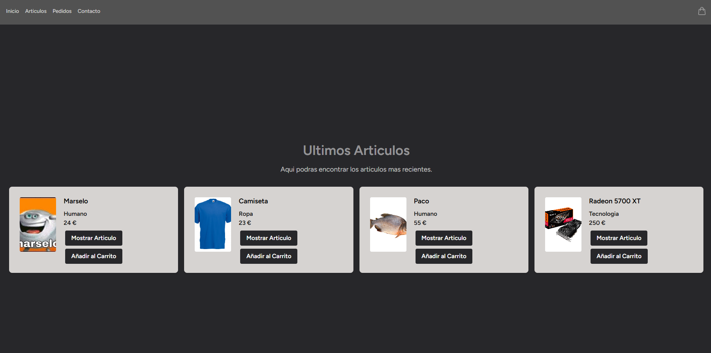

## Proyecto DWES

Mi proyecto es una tienda de articulos variados, la tienda estara compuesta por una pagina de incio donde se veran los ultimos articulos añadidos a esta, un listado de articulos que podra ser accedido por los clientes y podran ver los articulos en mas detalle, los administradores por el contrario, podran editar o eliminar los articulos.

Nuestra tienda tambien dispondra de un sistema de manejo de pedidos para los administradores, los cuales podran ver los pedidos que se han hecho, su estado actual, el cliente al que estan asociados los pedidos y su direccion, los clientes por el contrario solo podran ver sus propios pedidos.

----

A dia 31/01/2025 El proyecto cuenta con las siguientes funcionalidades :

* Sistema de Login y Registro.
* Landing page de la tienda.
* Sistema de roles final.
* Sistema de gestion de articulos.
* Visionado de articulos en detalle.
* Sistema de gestion de pedidos final.
* Sistema de carrito.
* Sistema de gestion de usuarios.

Aun tengo que añadir :

* Mejoras en sistema de carrito(Añadir mas cantidad de articulos desde el propio carrito).
* Mejoras en sistema de gestion de articulos(Ver stock de articulos o Imagen placeholder dependiendo de la categoria del articulo)
* Mejoras en migraciones y estructura de base de datos(Añadir stock para los articulos, Arreglar fallos que pueden ir surgiendo mientras acabo el desarrollo)

